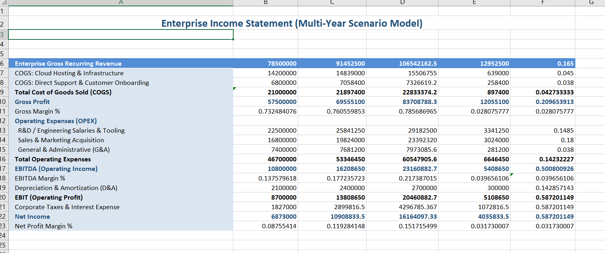
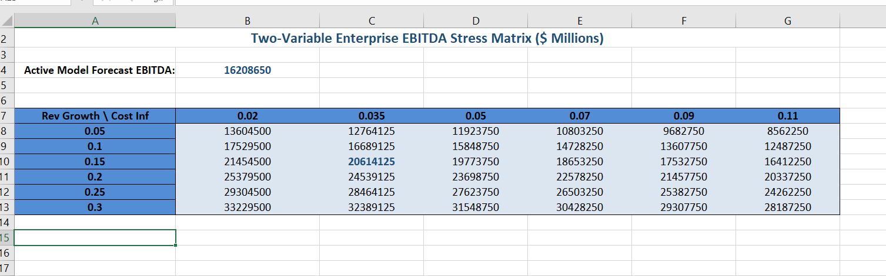
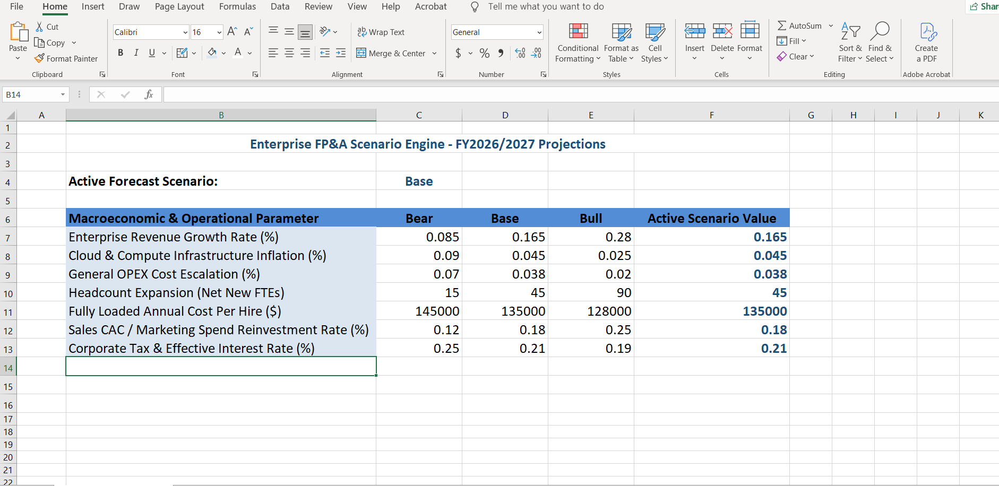

# Enterprise FP&A Financial Scenario & Budget Variance Suite

An end-to-end corporate financial planning and budget analysis suite built to evaluate departmental spend, track budget burn velocity, and stress-test EBITDA margins across a **50,000-row ERP General Ledger** ($78.5M baseline revenue).

---

## 📸 Executive Dashboard & Model Previews

### 1. Multi-Year Income Statement (P&L Forecast)


### 2. Two-Variable EBITDA Stress Matrix


### 3. Scenario Toggle Engine (Bear / Base / Bull)


---

## 📌 Project Background & Business Problem

Mid-to-large enterprises struggle with fragmented financial data when tracking quarterly departmental spending against authorized budget caps. Without automated variance tracking, budget overruns are often detected after quarter-close rather than proactively during the fiscal cycle.

This repository provides a modular, production-style FP&A workflow:
1. **Warehouse SQL Layer:** Ingests raw ERP transactional records, aggregates spend across cost centers, and automatically flags budget burn risk tiers (`Over Budget`, `At Risk`, `On Track`).
2. **Dynamic 3-Statement Excel Model:** Features a scenario toggle (`Bear`, `Base`, `Bull`) driven by exact-match indexing, dynamic year-over-year variance calculations, and a two-variable sensitivity grid testing 36 macroeconomic combinations.
3. **Executive Decision Brief:** Converts quantitative outputs into practical recommendations (cloud compute reserved instances, phased hiring gates, and operating expense controls).

---

## 🏗️ Data Architecture & Workflow

```
50,000+ Raw ERP Records ──► SQL Aggregation Engine ──► Dynamic Scenario Model ──► Two-Way Sensitivity Grid
(General Ledger Invoices)     (Clean Multi-Key Joins)    (Excel 3-Statement P&L)      (EBITDA Stress Testing)
```

---

## 📊 Summary Financial Projections ($ Millions)

| Metric | Conservative (Bear) | Base Case (Target) | Aggressive (Bull) |
| :--- | :---: | :---: | :---: |
| **Gross Revenue** | $85.17M (+8.5%) | **$91.45M (+16.5%)** | $100.48M (+28.0%) |
| **Cost of Goods Sold (COGS)** | $22.65M | **$21.90M** | $21.41M |
| **Gross Profit Margin (%)** | 73.4% | **76.1%** | 78.7% |
| **Total Operating Expenses (OPEX)** | $49.80M | **$53.35M** | $56.90M |
| **Operating Profit (EBITDA)** | **$12.72M** | **$16.21M** | **$22.17M** |
| **EBITDA Margin (%)** | 14.9% | **17.7%** | 22.1% |
| **Net Income (Bottom Line)** | **$7.96M** | **$10.91M** | **$15.77M** |

---

## 🛠️ Data Modeling & Engineering Decisions

* **Offloading Heavy Compute to SQL:** Processed all 50,000 invoice aggregations directly in the SQL database layer instead of using nested spreadsheet lookups. This prevents Excel lag and keeps workbook size compact.
* **Division-by-Zero Protection:** Wrapped all margin and variance percentage formulas with `COALESCE` in SQL and `=IF(cell=0, 0, ...)` in Excel to handle cost centers with zero spend without throwing `#DIV/0!` errors.
* **Exact-Match Indexing:** Synced scenario names across sheets using `=INDEX(..., 1, MATCH(...))` with exact-match mode (`0`) to ensure dynamic recalculation when switching between `Bear`, `Base`, and `Bull`.
* **Standard ANSI SQL Compatibility:** Kept database queries clean and portable across standard engines (PostgreSQL, Snowflake, Redshift, SQLite, and BigQuery).

---

## 📂 Repository File Structure

```text
├── data/
│   ├── enterprise_erp_general_ledger_50k.csv   # 50,000 line-item ERP expense records
│   └── department_budget_allocations.csv       # Authorized departmental budget caps
├── sql/
│   ├── 01_ddl_and_warehouse_schema.sql         # Table schemas and join index definitions
│   └── 02_advanced_variance_analysis.sql       # Budget vs. actuals variance & risk engine
├── models/
│   └── enterprise_budget_sensitivity_model_v2.xlsx # 3-tab financial scenario & sensitivity workbook
├── reports/
│   └── executive_financial_brief.md            # 1-page C-suite strategy & recommendations memo
├── scripts/
│   └── generate_enterprise_data.py             # Python data generation script
├── model_preview.png                           # P&L table preview screenshot
├── sensitivity_matrix.png                      # EBITDA matrix preview screenshot
├── scenario_inputs.png                         # Scenario toggle preview screenshot
├── .gitignore
└── README.md
```

---

## 🚀 How to Run & Replicate

### 1. Run Database Queries (SQL)
Run the scripts against your database or SQL client (DBeaver, pgAdmin, Snowflake worksheet):
```sql
-- Step 1: Create dimension and fact tables with indexes
\i sql/01_ddl_and_warehouse_schema.sql

-- Step 2: Execute variance rollup and risk scoring query
\i sql/02_advanced_variance_analysis.sql
```

### 2. Explore Financial Scenarios (Excel)
1. Open `models/enterprise_budget_sensitivity_model_v2.xlsx`.
2. Navigate to the **`Scenario Engine & Inputs`** tab.
3. Edit cell **`C4`** to `Bear`, `Base`, or `Bull` to watch the P&L and Sensitivity sheets dynamically update.
